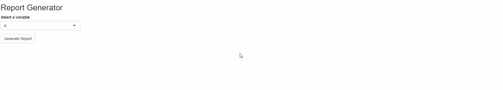

# shinyReports
> Simplifies automatic HTML report rendering from .Rmd files in [shiny](https://github.com/rstudio/shiny).

## Overview
This package adapts the Shiny -> .Rmd report generation workflow to automatically push HTML content to the client and open a new browser tab.

## Installation
Install directly from GitHub with:

```r
# install.packages("remotes")
remotes::install_github("aes21/shinyReports")
```

## Usage
For an example `shinyReports` application, you can launch the demo application directly from your R console:

```r
library(shinyReports)

# launch example app
shiny::runApp(system.file("examples", package = "shinyReports"))
```

### Demo


